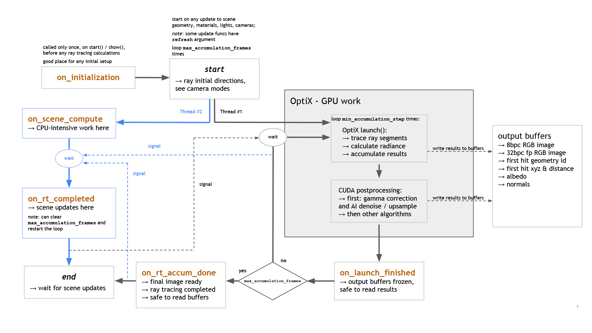
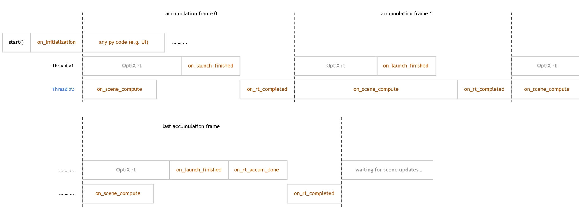

NpOptiX - base, headless raytracer
==================================

Ray-tracing and compute loop
----------------------------

Calculations in PlotOptiX are performed in threads parallel to the thread where you created :class:`plotoptix.NpOptiX`
object. This design allows building interactive applications where heavy calulations are not blocking UI. There are two
threads: one used for the ray tracing work done by OptiX engine (GPU work) and the second thread where any user calculations,
e.g. scene updates, can be performed (usually using CPU).

Callbacks are provided to synchrionize user code and OptiX tasks. The full workflow is illustrated in figures below, however it is best explained
with `the example code <https://github.com/rnd-team-dev/plotoptix/blob/master/examples/2_animations_and_callbacks/1_surface_plot_animated.ipynb>`__.
Note, code in calbacks should follow recommendations indicated in the Fig.1. and in the :ref:`callbacks` section. The
basic rules are:

* Access results stored in the output buffers only when they are frozen (``on_launch_finished``, ``on_rt_accum_done``) or use
  ``on_rt_accum_done`` to synchronize your code with the end of ray tracing; otherwise buffers may be still empty or contain
  undefined data.
* Put lenghty calculations in ``on_scene_compute`` so they can run in parallel to ray tracing. Heavy computations in other callbacks
  will degrade overall performance.
* Do the scene and configuration updates in ``on_rt_completed``. Note that most updates will reset the accumulation frame counter and the
  whole ray tracing loop will be restarted, which will also clear the output buffers. 

Fig. 1. PlotOptiX computations flow. Details of the OptiX tast are ommited for clarity (i.e. scene compilation and multi-gpu management).

Fig. 2. Timeline of tasks and callbacks.

API reference
-------------

.. autoclass:: plotoptix.NpOptiX

.. toctree::
   :caption: API Reference
   :maxdepth: 2

   npoptix_config
   npoptix_geometry
   npoptix_cameras
   npoptix_lights
   npoptix_materials
   npoptix_callbacks
